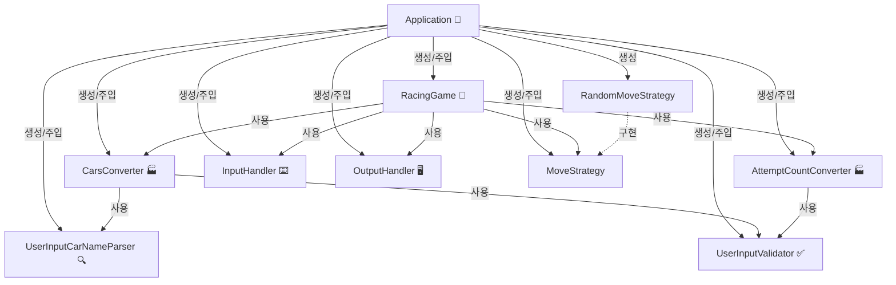

# java-racingcar-precourse

# 구현 기능 목록

**<도메인>**
- 자동차의 거리를 1만큼 증가시킬 수 있다.

- 0에서 9 사이의 랜덤값을 생성하여, 4 이상일 경우 전진하고 3 이하일 경우 멈춘다.

- 자동차 리스트를 스냅샷 리스트로 반환할 수 있다.

- 자동차 리스트로부터 우승자를 찾을 수 있다.

**<검증/변환>**
- 사용자 입력을 일급 컬렉션인 Cars로 변환한다.

- 사용자 입력을 시도할 횟수로 변환한다.

- 시도 횟수의 유효성을 검증한다.

  - 시도 횟수가 숫자가 아닐 경우, IllegalArgumentException 발생 후 애플리케이션이 종료된다.

  - 시도 횟수가 0 이하일 경우, IllegalArgumentException 발생 후 애플리케이션이 종료된다.

- 자동차 이름의 유효성을 검증한다.

  - 이름이 5자를 초과할 경우, IllegalArgumentException 발생 후 애플리케이션이 종료된다.

  - 이름이 비어있을 경우, IllegalArgumentException 발생 후 애플리케이션이 종료된다.

  - 이름에 공백이 포함될 경우, IllegalArgumentException 발생 후 애플리케이션이 종료된다.

- 자동차 이름의 중복을 검증한다.

  - 이름이 중복됐을 경우, IllegalArgumentException 발생 후 애플리케이션이 종료된다.

**<I/O>**
- 사용자로부터 입력을 받는다.

- 자동차명 입력 요청 메시지를 출력한다.

- 시도 횟수 입력 요청 메시지를 출력한다.

- 실행 결과 메시지를 출력한다.

- 라운드마다 각 자동차의 현재 상태(이름, 거리)를 출력한다.

- 모든 라운드가 종료된 후, 우승자를 형식에 맞게 출력한다.

**<전체 흐름 제어>**
- 레이싱 카의 전체 실행 흐름을 제어한다.

---
# 객체 협력 그래프
